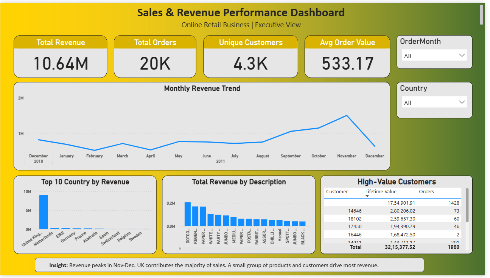

# 📊 Sales & Revenue Analytics

## Table of Contents

- [Overview](#overview)
- [Business Problem](#business-problem)
- [Dataset](#dataset)
- [Tools &amp; Technologies](#tools--technologies)
- [Project Structure](#project-structure)
- [Data Cleaning &amp; Preparation](#data-cleaning--preparation)
- [Exploratory Data Analysis (EDA)](#exploratory-data-analysis-eda)
- [Research Questions &amp; Key Findings](#research-questions--key-findings)
- [Dashboard](#dashboard)
- [How to Run This Project](#how-to-run-this-project)
- [Final Recommendations](#final-recommendations)
- [Author &amp; Contact](#author--contact)

---

## Overview

This project demonstrates an end-to-end **Sales & Revenue Analytics pipeline** for an online retail business.
It converts raw transactional data into executive-ready insights using a real-world workflow:

**- CSV → MySQL → SQL Modeling → Python EDA → Power BI Dashboard**

The objective is to show how a data analyst transforms messy data into **business decisions**.

---

## Business Problem

The business needs to understand:

- How much revenue is generated and lost
- Monthly growth and seasonality patterns
- Which countries and products drive revenue
- Customer behavior and retention
- Who the most valuable customers are

Leadership requires a **single executive dashboard** to monitor performance and guide strategy.

---

## Dataset

- Source: Online Retail transactional dataset
- Size: 500K+ rows
- Fields include:
  - InvoiceNo, StockCode, Description
  - Quantity, UnitPrice
  - InvoiceDate
  - CustomerID, Country

The data contains duplicates, cancellations, and invalid values—ideal for real-world analytics.

---

## Tools & Technologies

- **MySQL** – Data ingestion, cleaning, modeling
- **SQL** – Feature engineering & KPI layer
- **Python (Pandas, Matplotlib)** – EDA & analytical intelligence
- **Power BI** – Executive dashboard
- **GitHub** – Version control & portfolio hosting

---

## Project Structure

```
Sales-Revenue-Analytics/
│
├── data/
│   └── retail_analytics_ready_sample.csv   
│
├── powerbi/
│   ├── sales_dashboard.pbix
│   ├── dashboard_preview.png
│   └── background_kpi.png
│
├── python/
│   └── eda_retail.ipynb
│
├── sql/
│   └── retail_pipeline.sql
│
├── docs/
│   ├── project_charter.docx
│   └── sql_steps.docx
│
└── README.md
```

---

## Data Cleaning & Preparation

In SQL:

- Created raw table: `retail_sales`
- Built analytics layer: `retail_sales_clean`
- Engineered:
  - `OrderDate`
  - `OrderMonth`
  - `Revenue`
  - `IsCancelled`
  - `IsValid`

Business logic:

- Raw data preserved
- Invalid rows flagged (not deleted)
- Cancellations separated from valid sales
- Production-style, audit-safe modeling

## Exploratory Data Analysis (EDA)

In Python (`eda_retail.ipynb`):

- Pulled data from MySQL
- Detected and removed exact duplicates
- Built:
  - `df_dedup` – structurally clean data
  - `df_valid` – business-truth dataset
- Performed:
  - Revenue distribution analysis
  - Monthly trend analysis
  - Country & product performance
  - Customer segmentation (RFM-lite)
- Exported:
  - `retail_analytics_ready.csv` for BI

---

## Research Questions & Key Findings

### Questions Answered

- How much revenue is generated and lost?
- When does revenue peak?
- Which markets and products drive growth?
- How strong is customer retention?
- Who are the highest-value customers?

### Key Findings

- ~8–9% of revenue is lost due to cancellations
- Revenue is highly seasonal (Nov–Dec peak)
- A small set of products generates most revenue
- UK dominates sales → concentration risk
- Many customers place only one order
- Top customers contribute disproportionately

---

## Dashboard

The Power BI dashboard provides:

- KPI Cards: Revenue, Orders, Customers, AOV
- Monthly Revenue Trend
- Top Countries by Revenue
- Top Products by Revenue
- High-Value Customers Table
- Interactive Slicers: Time & Country



It is designed as an **executive decision panel**, not a static report.

---

## How to Run This Project

1. Import CSV into MySQL
2. Execute `sql/retail_pipeline.sql`
3. Open `python/eda_retail.ipynb` and:
   - Connect to MySQL
   - Run EDA
   - Export `retail_analytics_ready.csv`
4. Open `powerbi/sales_dashboard.pbix`
5. Refresh data using the exported CSV

---

## Final Recommendations

- Reduce cancellation rate to recover ~8% revenue leakage
- Prepare inventory and campaigns for Q4 demand
- Focus marketing on high-margin products
- Diversify beyond UK to reduce risk
- Introduce retention strategies for one-time buyers
- Create VIP programs for top customers

---

## Author & Contact

**Akash Gupta**
*Aspiring Data Analyst*
SQL • Python • Power BI

LinkedIn: *Add your profile link here*GitHub: *Add your GitHub link here*

> This project demonstrates my ability to build real-world analytics solutions from raw data to executive dashboards.
